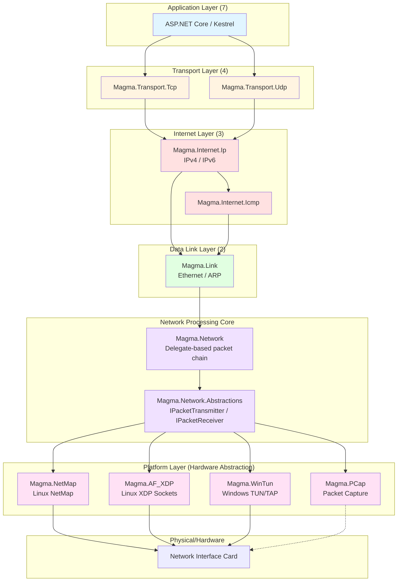

# Magma Architecture Guide

This document provides a comprehensive overview of Magma's architecture, explaining how components compose and how data flows through the system. This guide is intended for contributors who need to understand where new code fits and how the various layers interact.

## Table of Contents

- [Overview](#overview)
- [OSI Layer Mapping](#osi-layer-mapping)
- [Component Architecture](#component-architecture)
- [Packet Processing Flow](#packet-processing-flow)
- [Core Abstractions](#core-abstractions)
- [Platform Backends](#platform-backends)
- [Memory Management](#memory-management)
- [Adding New Components](#adding-new-components)

## Overview

Magma is a modular, high-performance network stack for .NET that provides direct packet-level access from the Data Link layer up through the Transport layer. The architecture follows these key principles:

1. **Layered Design**: Components map cleanly to OSI model layers
2. **Zero-Copy Operations**: Packets stay in shared memory buffers throughout processing
3. **Delegate-Based Processing**: Extensible packet processing chains using function delegates
4. **Platform Abstraction**: Uniform interface across different kernel-bypass mechanisms
5. **Type-Safe Headers**: Struct-based packet headers with compile-time layout guarantees

## OSI Layer Mapping

The following diagram shows how Magma projects map to OSI model layers and how packets flow through the system:



### Layer Responsibilities

| Layer | Projects | Responsibility |
|-------|----------|----------------|
| **Application (7)** | ASP.NET Core, Kestrel | High-level application logic, HTTP/HTTPS |
| **Transport (4)** | `Magma.Transport.Tcp`<br/>`Magma.Transport.Udp` | Connection management, reliable delivery, port addressing |
| **Internet (3)** | `Magma.Internet.Ip`<br/>`Magma.Internet.Icmp` | IP routing, fragmentation, ICMP messaging |
| **Data Link (2)** | `Magma.Link` | Ethernet framing, MAC addressing, ARP |
| **Processing Core** | `Magma.Network`<br/>`Magma.Network.Abstractions` | Packet dispatch, protocol demultiplexing, abstraction contracts |
| **Platform** | `Magma.NetMap`<br/>`Magma.AF_XDP`<br/>`Magma.WinTun`<br/>`Magma.PCap` | Hardware interface, DMA buffers, kernel bypass |

## Component Architecture

### Core Components

#### Magma.Common
Provides fundamental utilities used across all layers:
- **Checksums**: Internet checksum calculations for IP/TCP/UDP
- **IP Addresses**: Value types (`V4Address`, `V6Address`) for efficient IP address handling
- **Binary Operations**: Endianness conversion, bit manipulation

#### Magma.Link (Data Link Layer)
Handles Ethernet frames and ARP:
- **`Ethernet` struct**: 14-byte Ethernet frame header
- **`MacAddress` struct**: 6-byte MAC address representation
- **`Arp` struct**: ARP packet parsing
- **`EtherType` enum**: Protocol identification (IPv4, IPv6, ARP)

#### Magma.Internet.Ip (Internet Layer)
Manages IP packets:
- **`IPv4` struct**: IPv4 header with checksum validation
- **`IPv6` struct**: IPv6 header and extension handling
- **`IPv6Fragment` struct**: IPv6 fragmentation
- **Header validation**: Checksum verification, length checks

#### Magma.Internet.Icmp
ICMP protocol support for diagnostic messages (ping, traceroute, etc.)

#### Magma.Transport.Tcp (Transport Layer)
Full TCP implementation:
- **`TcpHeader` struct**: 20-byte base TCP header
- **`TcpHeaderWithOptions` struct**: TCP with variable-length options
- **`TcpConnection<T>`**: Per-connection state machine
- **`TcpTransportReceiver<T>`**: Accept and dispatch incoming connections

#### Magma.Transport.Udp
UDP protocol implementation:
- **`Udp` struct**: 8-byte UDP header
- Connectionless datagram processing

### Processing Core

#### Magma.Network
Implements the delegate-based packet processing chain:

```csharp
// Delegate definitions for each layer
public delegate bool ConsumeInternetLayer(
    in Ethernet ethernetFrame,
    ReadOnlySpan<byte> input);

public delegate bool IPv4ConsumeTransportLayer(
    in Ethernet ethernetFrame,
    in IPv4 ipv4,
    ReadOnlySpan<byte> input);

public delegate bool IPv6ConsumeTransportLayer(
    in Ethernet ethernetFrame,
    in IPv6 ipv6,
    ReadOnlySpan<byte> input);
```

The `PacketReceiver` class chains these delegates:

1. **Parse Ethernet** → Dispatch based on `EtherType`
2. **Parse IP** → Dispatch based on protocol number
3. **Parse Transport** → Deliver to application

If any layer returns `false`, the packet is passed to the host OS network stack.

#### Magma.Network.Abstractions
Defines the core contracts that all components implement:

**`IPacketTransmitter`** - Provides buffers and sends packets:
```csharp
public interface IPacketTransmitter
{
    // Get a buffer from the pool for constructing outgoing packets
    bool TryGetNextBuffer(out Memory<byte> buffer);

    // Send a constructed packet
    Task SendBuffer(ReadOnlyMemory<byte> buffer);

    // Generate random TCP sequence numbers
    uint RandomSequenceNumber();
}
```

**`IPacketReceiver`** - Processes incoming packets:
```csharp
public interface IPacketReceiver
{
    // Process a received packet (returns null if consumed, input if passed through)
    T TryConsume<T>(T input) where T : IMemoryOwner<byte>;

    // Flush any pending ACKs or other deferred transmissions
    void FlushPendingAcks();
}
```

### Platform Backends

Platform backends implement `IPacketTransmitter` and integrate with `IPacketReceiver` to provide packet I/O:

#### Magma.NetMap (Linux)
Integrates with NetMap kernel module for high-performance packet I/O:
- **`NetMapPort<T>`**: Opens NetMap device and manages receive/transmit rings
- **`NetMapTransmitRing`**: Implements `IPacketTransmitter` using NetMap TX ring
- **`NetMapReceiveRing`**: Polls RX ring and forwards to `IPacketReceiver`
- **`NetMapOwnedMemory`**: Zero-copy buffer management wrapping NetMap shared memory

#### Magma.AF_XDP (Linux)
Modern kernel-native XDP socket implementation (Linux 4.18+):
- **`AF_XDPPort<T>`**: Opens AF_XDP socket and manages UMEM region
- **`AF_XDPTransmitRing`**: Implements `IPacketTransmitter` using XDP TX ring
- **`AF_XDPReceiveRing`**: Polls RX ring using XDP socket API
- Zero-copy operation with eBPF/XDP in-kernel filtering

#### Magma.WinTun (Windows)
Integrates with WinTun TUN/TAP driver for Windows:
- **`WinTunPort<T>`**: Opens WinTun adapter session
- **`WinTunTransmitter`**: Implements `IPacketTransmitter`
- **`WinTunTransportReceiver`**: Polls WinTun for packets
- User-space driver with minimal overhead

#### Magma.PCap
Packet capture to PCAP files:
- Write captured packets for analysis with Wireshark, tcpdump
- Read-only path for monitoring/debugging

## Packet Processing Flow

### Receive Path (Inbound Packets)

Here's how a packet flows from the NIC to the application:

```
┌─────────────────────────────────────────────────────────────────┐
│ 1. Hardware NIC                                                  │
│    Packet arrives at network interface                           │
└───────────────────────────┬─────────────────────────────────────┘
                            │
                            ▼
┌─────────────────────────────────────────────────────────────────┐
│ 2. Platform Backend (e.g., NetMapReceiveRing)                   │
│    - Packet placed in shared memory ring buffer                 │
│    - Wraps buffer in IMemoryOwner<byte>                         │
│    - Calls IPacketReceiver.TryConsume()                         │
└───────────────────────────┬─────────────────────────────────────┘
                            │
                            ▼
┌─────────────────────────────────────────────────────────────────┐
│ 3. TcpTransportReceiver<T> : IPacketReceiver                    │
│    - Ethernet.TryConsume() → parse 14-byte Ethernet header      │
│    - IPv4.TryConsume() → parse 20+ byte IP header               │
│    - TcpHeaderWithOptions.TryConsume() → parse TCP header       │
│    - Validate checksums                                          │
└───────────────────────────┬─────────────────────────────────────┘
                            │
                            ▼
┌─────────────────────────────────────────────────────────────────┐
│ 4. TcpConnection<T>                                              │
│    - Match connection by (src IP, src port)                     │
│    - Update TCP state machine                                   │
│    - Hand payload to Kestrel connection                         │
└───────────────────────────┬─────────────────────────────────────┘
                            │
                            ▼
┌─────────────────────────────────────────────────────────────────┐
│ 5. ASP.NET Core / Application                                   │
│    Process HTTP request, run middleware, generate response       │
└─────────────────────────────────────────────────────────────────┘
```

**Key Points:**
- **Zero-Copy**: The packet buffer stays in shared memory throughout
- **Type-Punning**: Headers are overlaid on byte spans using `Unsafe.As<,>()`
- **Early Rejection**: Invalid packets are rejected as early as possible
- **Passthrough**: Unhandled packets return non-null from `TryConsume()` to pass to host OS

### Transmit Path (Outbound Packets)

Here's how data flows from the application to the wire:

```
┌─────────────────────────────────────────────────────────────────┐
│ 1. ASP.NET Core / Application                                   │
│    Application writes response data                              │
└───────────────────────────┬─────────────────────────────────────┘
                            │
                            ▼
┌─────────────────────────────────────────────────────────────────┐
│ 2. TcpConnection<T>                                              │
│    - Call IPacketTransmitter.TryGetNextBuffer()                 │
│    - Construct packet headers in buffer                         │
│    - Copy payload after headers                                 │
│    - Call IPacketTransmitter.SendBuffer()                       │
└───────────────────────────┬─────────────────────────────────────┘
                            │
                            ▼
┌─────────────────────────────────────────────────────────────────┐
│ 3. Platform Transmit Ring (e.g., NetMapTransmitRing)            │
│    - Queue buffer metadata to transmit ring                     │
│    - Update ring head pointer                                   │
│    - Trigger hardware flush if needed                           │
└───────────────────────────┬─────────────────────────────────────┘
                            │
                            ▼
┌─────────────────────────────────────────────────────────────────┐
│ 4. Hardware NIC                                                  │
│    DMA engine reads packet from shared memory and transmits      │
└─────────────────────────────────────────────────────────────────┘
```

**Key Points:**
- **Buffer Ownership**: Caller gets buffer from transmitter, fills it, returns it
- **Async Send**: `SendBuffer()` returns immediately; actual transmission is async
- **Header Construction**: Headers are written directly into transmit buffers
- **No Copying**: DMA reads directly from shared memory buffers

## Core Abstractions

### The IPacketTransmitter / IPacketReceiver Contract

This contract is the key abstraction that allows different platform backends to plug into the same upper-layer protocols.

#### Design Philosophy

1. **Separation of Concerns**: Receivers parse and dispatch; transmitters allocate and send
2. **Buffer Ownership**: Clear ownership transfer prevents use-after-free bugs
3. **Synchronous Parsing, Async Sending**: Parse immediately, send when convenient
4. **Passthrough Semantics**: Unhandled packets can be forwarded to host network stack

#### IPacketTransmitter Implementation Pattern

```csharp
public class MyTransmitRing : IPacketTransmitter
{
    private BufferPool _bufferPool;
    private TransmitRing _ring;

    public bool TryGetNextBuffer(out Memory<byte> buffer)
    {
        // Get next available TX slot from ring buffer
        if (_ring.TryGetNextSlot(out var slotIndex))
        {
            var ownedMemory = _bufferPool.GetBuffer(slotIndex);
            buffer = ownedMemory.Memory;
            return true;
        }
        buffer = default;
        return false;
    }

    public Task SendBuffer(ReadOnlyMemory<byte> buffer)
    {
        // Extract buffer index and enqueue to hardware
        var ownedMemory = GetOwnedMemory(buffer);
        _ring.Enqueue(ownedMemory.BufferIndex, buffer.Length);
        _ring.Flush();
        return Task.CompletedTask;
    }

    public uint RandomSequenceNumber()
    {
        return (uint)_random.Next();
    }
}
```

#### IPacketReceiver Implementation Pattern

```csharp
public class MyPacketReceiver : IPacketReceiver
{
    public T TryConsume<T>(T input) where T : IMemoryOwner<byte>
    {
        var span = input.Memory.Span;

        // Try to parse Ethernet header
        if (!Ethernet.TryConsume(span, out var eth, out var data))
            return input; // Can't parse, pass to OS

        // Try to parse IP header
        if (!IPv4.TryConsume(data, out var ip, out data))
            return input; // Not IPv4, pass to OS

        // Handle the packet
        ProcessPacket(eth, ip, data);

        // Packet consumed, dispose and return null
        input.Dispose();
        return default;
    }

    public void FlushPendingAcks()
    {
        // Send any deferred ACKs
    }
}
```

**Contract Rules:**
- `TryConsume()` returns `null` if packet was consumed
- `TryConsume()` returns `input` if packet should be passed to OS
- Caller must dispose `input` if it returns non-null
- `FlushPendingAcks()` is called periodically to send deferred transmissions

### Delegate-Based Packet Processing

The `Magma.Network` package implements a flexible delegate-based packet processing chain. This allows different protocol layers to be chained together without tight coupling.

#### Delegate Chain Example

```csharp
public class PacketReceiver : IPacketReceiver
{
    // Delegates for each protocol layer
    public ConsumeInternetLayer IPv4Consumer { get; set; }
    public ConsumeInternetLayer IPv6Consumer { get; set; }
    public ConsumeInternetLayer ArpConsumer { get; set; }

    public T TryConsume<T>(T owner) where T : IMemoryOwner<byte>
    {
        var input = owner.Memory.Span;
        var result = false;

        if (Ethernet.TryConsume(input, out var ethernetFrame, out var data))
        {
            switch (ethernetFrame.Ethertype)
            {
                case EtherType.IPv4:
                    result = IPv4Consumer?.Invoke(in ethernetFrame, data) ?? false;
                    break;
                case EtherType.IPv6:
                    result = IPv6Consumer?.Invoke(in ethernetFrame, data) ?? false;
                    break;
                case EtherType.Arp:
                    result = ArpConsumer?.Invoke(in ethernetFrame, data) ?? false;
                    break;
            }
        }

        if (result)
        {
            owner.Dispose();
            return default;
        }
        return owner;
    }
}
```

#### Why Delegates?

1. **Extensibility**: Add new protocols without modifying core classes
2. **Performance**: Delegate invocation is very fast (inline-eligible)
3. **Testability**: Easy to inject test handlers for protocol layers
4. **Flexibility**: Different receiver instances can have different handlers

## Platform Backends

### How Backends Plug Into Abstractions

Each platform backend provides three key components:

1. **Port/Adapter Class**: Manages the platform-specific device
2. **Transmit Ring**: Implements `IPacketTransmitter`
3. **Receive Ring/Thread**: Polls for packets and calls `IPacketReceiver.TryConsume()`

#### Example: NetMap Backend

```
┌──────────────────────────────────────────────────────────────────┐
│ NetMapPort<TReceiver>                                            │
│                                                                  │
│  ┌────────────────┐         ┌────────────────┐                 │
│  │ RxTxPair       │         │ RxTxPair       │                 │
│  │                │         │                │                 │
│  │  ┌──────────┐  │         │  ┌──────────┐  │                 │
│  │  │ RX Ring  │  │   ...   │  │ RX Ring  │  │  (N queues)     │
│  │  │          │  │         │  │          │  │                 │
│  │  │ Thread ──┼──┼─calls─→ IPacketReceiver │                 │
│  │  └──────────┘  │         │  │          │  │                 │
│  │                │         │  └──────────┘  │                 │
│  │  ┌──────────┐  │         │  ┌──────────┐  │                 │
│  │  │ TX Ring  │  │         │  │ TX Ring  │  │                 │
│  │  │          │  │         │  │          │  │                 │
│  │  │ implements │         │  │ implements │                 │
│  │  │ IPacket  │  │         │  │ IPacket  │  │                 │
│  │  │ Transmit.│  │         │  │ Transmit.│  │                 │
│  │  └──────────┘  │         │  └──────────┘  │                 │
│  └────────────────┘         └────────────────┘                 │
│                                                                  │
│  Shared Memory Region (mmap'd from /dev/netmap)                 │
│  ┌────────────────────────────────────────────────────────┐    │
│  │ Buffer 0 | Buffer 1 | Buffer 2 | ... | Buffer N        │    │
│  └────────────────────────────────────────────────────────┘    │
└──────────────────────────────────────────────────────────────────┘
```

#### Example: AF_XDP Backend

```
┌──────────────────────────────────────────────────────────────────┐
│ AF_XDPPort<TReceiver>                                            │
│                                                                  │
│  ┌──────────────────────────────────────────────────────────┐  │
│  │ XDP Socket                                                │  │
│  │                                                            │  │
│  │  ┌──────────┐        ┌──────────┐                        │  │
│  │  │ FILL Ring│◄───────│ RX Ring  │                        │  │
│  │  └──────────┘        └─────┬────┘                        │  │
│  │                             │                              │  │
│  │                             └──calls──→ IPacketReceiver    │  │
│  │                                                            │  │
│  │  ┌──────────┐        ┌──────────┐                        │  │
│  │  │ COMP Ring│───────►│ TX Ring  │ (implements             │  │
│  │  └──────────┘        └──────────┘  IPacketTransmitter)    │  │
│  │                                                            │  │
│  └──────────────────────────────────────────────────────────┘  │
│                                                                  │
│  UMEM Region (user-space memory, shared with kernel)            │
│  ┌────────────────────────────────────────────────────────┐    │
│  │ Frame 0 | Frame 1 | Frame 2 | ... | Frame N            │    │
│  └────────────────────────────────────────────────────────┘    │
└──────────────────────────────────────────────────────────────────┘
```

#### Example: WinTun Backend

```
┌──────────────────────────────────────────────────────────────────┐
│ WinTunPort<TReceiver>                                            │
│                                                                  │
│  ┌──────────────────────────────────────────────────────────┐  │
│  │ WinTun Session                                            │  │
│  │                                                            │  │
│  │  Receive Thread ───calls──→ IPacketReceiver              │  │
│  │       │                                                    │  │
│  │       │ (polls WintunReceivePacket)                       │  │
│  │       │                                                    │  │
│  │  WinTunTransmitter ──implements──→ IPacketTransmitter     │  │
│  │       │                                                    │  │
│  │       │ (calls WintunAllocateSendPacket/SendPacket)       │  │
│  │                                                            │  │
│  └──────────────────────────────────────────────────────────┘  │
│                                                                  │
│  WinTun Driver (kernel mode)                                    │
│  ┌────────────────────────────────────────────────────────┐    │
│  │ Virtual Network Adapter                                 │    │
│  └────────────────────────────────────────────────────────┘    │
└──────────────────────────────────────────────────────────────────┘
```

### Backend Comparison

| Feature | NetMap | AF_XDP | WinTun |
|---------|--------|--------|--------|
| **Platform** | Linux | Linux | Windows |
| **Kernel Version** | Any (module) | 4.18+ | Win 7+ |
| **Integration** | Out-of-tree module | In-kernel (eBPF/XDP) | Signed driver |
| **Performance** | Excellent | Excellent | Excellent |
| **Zero-Copy** | ✅ Yes | ✅ Yes | ✅ Yes (minimized copies) |
| **Multi-Queue** | ✅ Yes | ✅ Yes | ❌ No |
| **Setup Complexity** | High | Medium | Low |
| **Maintenance** | Manual updates | Kernel updates | Auto-update |

## Memory Management

Magma uses zero-copy techniques throughout to minimize overhead:

### Buffer Ownership Model

1. **Platform Backend Allocates**: Buffers come from shared memory region (mmap, UMEM)
2. **Wrapped in IMemoryOwner**: Buffer wrapped with ownership tracking
3. **Passed Up Stack**: Each layer parses headers, slices to payload
4. **Single Owner**: Only one component "owns" buffer at a time
5. **Dispose to Release**: Calling `Dispose()` returns buffer to pool

### Header Parsing Pattern

All protocol headers follow this pattern:

```csharp
[StructLayout(LayoutKind.Sequential, Pack = 1)]
public struct MyHeader
{
    public ushort Field1;
    public uint Field2;
    // ... more fields in wire order

    public static bool TryConsume(
        ReadOnlySpan<byte> input,
        out MyHeader header,
        out ReadOnlySpan<byte> data)
    {
        if (input.Length >= Unsafe.SizeOf<MyHeader>())
        {
            // Type-pun: overlay struct on byte span
            header = Unsafe.As<byte, MyHeader>(
                ref MemoryMarshal.GetReference(input));

            // Slice to payload
            data = input.Slice(Unsafe.SizeOf<MyHeader>());
            return true;
        }

        header = default;
        data = default;
        return false;
    }
}
```

**Why This Works:**
- `[StructLayout(LayoutKind.Sequential, Pack = 1)]` guarantees memory layout matches wire format
- `Unsafe.As<,>()` is a zero-cost cast (no copying)
- `Span<T>.Slice()` is a pointer + length (no copying)
- Result: Headers parsed without allocating or copying

### Unsafe Code Safety

While Magma uses `unsafe` code extensively, it follows strict safety rules:

1. **Bounded Access**: All buffer accesses are bounds-checked via `Span<T>`
2. **Struct Layout**: `StructLayout` attributes guarantee correct alignment
3. **No Pointer Arithmetic**: Use `Span<T>` methods instead of raw pointers
4. **Ownership Transfer**: Clear ownership prevents use-after-free
5. **Validation**: Lengths and checksums validated before processing

## Adding New Components

### Adding a New Protocol Layer

To add a new protocol (e.g., QUIC), follow these steps:

1. **Create Protocol Project**: `Magma.Transport.Quic`

2. **Define Header Struct**:
```csharp
[StructLayout(LayoutKind.Sequential, Pack = 1)]
public struct QuicHeader
{
    // Fields in wire order
    public byte Flags;
    public ulong ConnectionId;
    // ...

    public static bool TryConsume(
        ReadOnlySpan<byte> input,
        out QuicHeader header,
        out ReadOnlySpan<byte> data)
    {
        // Standard pattern
    }
}
```

3. **Implement Receiver**:
```csharp
public class QuicReceiver : IPacketReceiver
{
    public T TryConsume<T>(T input) where T : IMemoryOwner<byte>
    {
        // Parse UDP, then QUIC
        // Process QUIC packets
    }
}
```

4. **Add Delegate** (if extending `Magma.Network`):
```csharp
public delegate bool ConsumeQuicLayer(
    in Ethernet ethernetFrame,
    in IPv4 ipv4,
    in Udp udp,
    ReadOnlySpan<byte> input);
```

5. **Wire Up in Tests**: Create test fixtures and validate

### Adding a New Platform Backend

To add a new platform backend (e.g., DPDK):

1. **Create Platform Project**: `Magma.DPDK`

2. **Implement Port Class**:
```csharp
public class DpdkPort<TReceiver> : IDisposable
    where TReceiver : IPacketReceiver
{
    public void Open() { /* Initialize DPDK */ }
    public void Dispose() { /* Cleanup */ }
}
```

3. **Implement Transmit Ring**:
```csharp
public class DpdkTransmitRing : IPacketTransmitter
{
    public bool TryGetNextBuffer(out Memory<byte> buffer)
    {
        // Allocate from DPDK mempool
    }

    public Task SendBuffer(ReadOnlyMemory<byte> buffer)
    {
        // Enqueue to DPDK TX ring
    }

    public uint RandomSequenceNumber() => /* ... */;
}
```

4. **Implement Receive Polling**:
```csharp
private void ReceiveLoop()
{
    while (true)
    {
        var burst = dpdk.ReceiveBurst();
        foreach (var packet in burst)
        {
            var result = _receiver.TryConsume(packet);
            if (result != null)
            {
                // Pass to kernel
                result.Dispose();
            }
        }
    }
}
```

5. **Add Integration Tests**: Validate with real hardware

### Guidelines for New Code

1. **Follow Existing Patterns**: Match the style of existing protocol layers
2. **Use Spans and Memory**: Avoid arrays and copying
3. **Validate Input**: Check lengths and checksums
4. **Handle Errors Gracefully**: Return false/null instead of throwing
5. **Write Tests**: Unit tests and integration tests
6. **Document Public APIs**: XML comments on public types and members
7. **Performance**: Profile and optimize critical paths

## Summary

Magma's architecture provides:

- **Layered Design**: Clear separation between OSI layers
- **Zero-Copy**: Packets stay in shared memory throughout processing
- **Pluggable Backends**: Uniform abstraction over different kernel-bypass mechanisms
- **Type-Safe**: Compile-time guarantees for packet structure layouts
- **High Performance**: Optimized for low-latency, high-throughput scenarios

The `IPacketTransmitter` / `IPacketReceiver` contract is the key abstraction that allows upper-layer protocols (TCP, UDP) to work unchanged across different platform backends (NetMap, AF_XDP, WinTun).

The delegate-based processing chain in `Magma.Network` provides flexibility for extending and customizing packet handling without modifying core classes.

For more information:
- **Integration Guide**: [docs/INTEGRATION_GUIDE.md](INTEGRATION_GUIDE.md) - Platform-specific setup
- **README**: [README.md](../README.md) - Project overview and getting started
- **Source Code**: Browse the `src/` directory to see implementations

## References

- [OSI Model](https://en.wikipedia.org/wiki/OSI_model)
- [AF_XDP Documentation](https://www.kernel.org/doc/html/latest/networking/af_xdp.html)
- [NetMap Framework](https://github.com/luigirizzo/netmap)
- [WinTun Driver](https://www.wintun.net/)
- [Zero-Copy Networking](https://en.wikipedia.org/wiki/Zero-copy)
